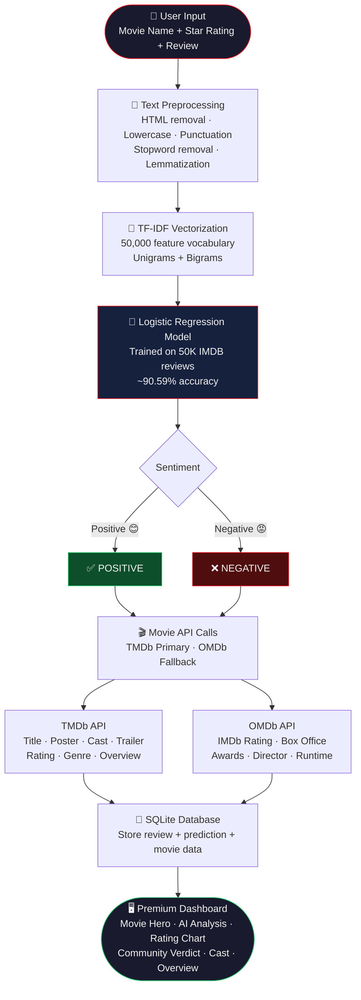

<div align="center">

# 🎬 YentiFlix
### AI Powered Movie Review Analyzer

*Predict sentiment. Discover movies. Experience cinema intelligence.*

[](https://python.org)
[](https://flask.palletsprojects.com)
[](https://scikit-learn.org)
[](https://sqlite.org)
[](https://developer.mozilla.org/en-US/docs/Web/HTML)
[](https://developer.mozilla.org/en-US/docs/Web/CSS)
[](https://developer.mozilla.org/en-US/docs/Web/JavaScript)
[](LICENSE)

[](https://github.com/Yash-Verse09/YentiFlix/stargazers)
[](https://github.com/Yash-Verse09/YentiFlix/network/members)

---

*A full-stack Machine Learning web application that analyzes movie reviews using Natural Language Processing, fetches real-time movie data from TMDb & OMDb APIs, and presents a premium Netflix-inspired dashboard.*

[**Live Demo**](#) · 🚨 [Report Bug](https://github.com/Yash-Verse09/YentiFlix-Movie-Review-Analyzer/issues) •
💡 [Request Feature](https://github.com/Yash-Verse09/YentiFlix-Movie-Review-Analyzer/issues)
</div>

---

## 📸 Screenshots

### 🏠 Homepage
The landing page where users enter a movie name, rating, and review.


---

### ✍️ Movie Review Input
Review submission form with movie title, user rating, and review text.


---

### 🎬 Movie Details
Displays movie poster, release date, genres, cast, runtime, director, trailer, and other metadata.


---

### 😊 Sentiment Analysis Result
Shows the predicted sentiment, confidence score, and review summary.


---

### 📊 Analytics Charts
Visualizes sentiment distribution and positive vs negative review ratio.


---

## 📋 Table of Contents

- [About the Project](#-about-the-project)
- [Features](#-features)
- [Tech Stack](#-tech-stack)
- [Project Workflow](#-project-workflow)
- [Folder Structure](#-folder-structure)
- [Getting Started](#-getting-started)
- [Environment Variables](#-environment-variables)
- [API Integration](#-api-integration)
- [Dataset](#-dataset)
- [Machine Learning](#-machine-learning)
- [Future Improvements](#-future-improvements)
- [Author](#-author)
- [License](#-license)

---

## 🎯 About the Project

> **YentiFlix** is a production-ready AI-powered web application built with **Flask** and **Machine Learning** that predicts the sentiment of movie reviews (Positive / Negative) and enriches results with real movie data fetched from **TMDb** and **OMDb** APIs — all presented inside a premium, responsive **Netflix-inspired dashboard**.

This project demonstrates the complete ML pipeline from raw text preprocessing to a deployed web application, making it a strong portfolio project that showcases skills in **NLP**, **Machine Learning**, **API integration**, **Flask development**, and **modern frontend design**.

---

## ✨ Features

| Category | Feature |
|---|---|
| 🤖 **AI & ML** | Sentiment prediction (Positive / Negative) with confidence score |
| 🎬 **Movie Data** | Real movie search powered by TMDb API |
| ⭐ **Ratings** | IMDb rating, TMDb rating, user rating input |
| 🎭 **Cast & Crew** | Top cast members with photos, director information |
| 📖 **Movie Info** | Genre, runtime, overview, release date, box office, awards |
| 🖼️ **Media** | Movie poster, backdrop image, YouTube trailer link |
| 📊 **Analytics** | Rating comparison chart, recommendation meter, sentiment gauge |
| 💾 **Database** | SQLite storage for all user reviews and predictions |
| 📱 **UI/UX** | Fully responsive, Netflix dark theme, glassmorphism design |
| 🔒 **Error Handling** | API fallbacks, graceful error messages, input validation |

---

## 🛠️ Tech Stack

<details>
<summary><strong>Backend</strong></summary>

| Technology | Version | Purpose |
|---|---|---|
| Python | 3.12 | Core language |
| Flask | 3.0 | Web framework |
| SQLite | 3 | Database |
| Joblib | 1.4 | Model serialization |

</details>

<details>
<summary><strong>Machine Learning & NLP</strong></summary>

| Technology | Version | Purpose |
|---|---|---|
| Scikit-learn | 1.5 | ML model & TF-IDF |
| NLTK | 3.8 | Text preprocessing |
| Pandas | 2.2 | Data manipulation |
| NumPy | 1.26 | Numerical operations |
| Matplotlib | 3.9 | Chart generation |

</details>

<details>
<summary><strong>Frontend</strong></summary>

| Technology | Purpose |
|---|---|
| HTML5 | Structure |
| CSS3 | Styling & animations |
| JavaScript (Vanilla) | Interactivity |
| Font Awesome 6 | Icons |
| Google Fonts (Poppins) | Typography |

</details>

<details>
<summary><strong>APIs</strong></summary>

| API | Purpose |
|---|---|
| TMDb API | Movie search, cast, trailer, poster, ratings |
| OMDb API | IMDb rating, box office, awards, director |

</details>

---

## 🔄 Project Workflow



---

## 📁 Folder Structure

```
YentiFlix/
│
├── 📄 app.py                    # Flask application entry point
├── 📄 database.py               # SQLite database setup & operations
├── 📄 movie_api.py              # TMDb + OMDb API integration
├── 📄 requirements.txt          # Python dependencies
├── 📄 .env.example              # Environment variable template
├── 📄 README.md                 # Project documentation
├── 📄 .gitignore                # Git ignore rules
├── 📄 LICENSE                   # MIT License
│
├── 📂 data/
│   ├── 📂 raw/
│   │   └── 📄 reviews.csv       # Original IMDB 50K dataset
│   └── 📂 processed/
│       └── 📄 cleaned_reviews.csv  # Preprocessed training data
│
├── 📂 models/
│   ├── 📄 sentiment_model.pkl   # Trained Logistic Regression model
│   └── 📄 tfidf_vectorizer.pkl  # Fitted TF-IDF vectorizer
│
├── 📂 src/
│   ├── 📄 preprocess.py         # Text cleaning pipeline
│   ├── 📄 train_model.py        # Model training script
│   ├── 📄 predict.py            # CLI prediction tool
│   ├── 📄 utils.py              # Shared helpers & constants
│   └── 📄 visualize.py          # Chart generation (Matplotlib)
│
├── 📂 templates/
│   ├── 📄 base.html             # Base layout template
│   ├── 📄 index.html            # Homepage with review form
│   └── 📄 result.html           # Prediction result dashboard
│
├── 📂 static/
│   ├── 📂 css/
│   │   └── 📄 style.css         # Global stylesheet
│   ├── 📂 js/
│   │   └── 📄 script.js         # Frontend interactions
│   └── 📂 charts/
│       ├── 📄 sentiment_distribution.png
│       └── 📄 sentiment_pie.png
│
└── 📂 notebooks/
    └── 📄 experimentation.ipynb  # EDA & model experiments
```

---

## 🚀 Getting Started

### Prerequisites

- Python 3.10 or higher
- pip package manager
- Git
- TMDb API Key ([Get free key](https://www.themoviedb.org/settings/api))
- OMDb API Key ([Get free key](https://www.omdbapi.com/apikey.aspx))

### Installation

**1. Clone the repository**

```bash
git clone https://github.com/Yash-Verse09/YentiFlix.git
cd YentiFlix
```

**2. Create and activate virtual environment**

```bash
# Create virtual environment
python -m venv venv

# Activate — Windows
venv\Scripts\activate

# Activate — macOS / Linux
source venv/bin/activate
```

**3. Install dependencies**

```bash
pip install -r requirements.txt
```

**4. Set up environment variables**

```bash
# Copy the template
cp .env.example .env

# Open .env and add your API keys
```

**5. Download NLTK data**

```python
python -c "import nltk; nltk.download('stopwords'); nltk.download('wordnet'); nltk.download('omw-1.4')"
```

**6. Preprocess the dataset**

```bash
python src/preprocess.py
```

**7. Train the ML model**

```bash
python src/train_model.py
```

**8. Generate charts**

```bash
python src/visualize.py
```

**9. Run the application**

```bash
python app.py
```

**10. Open in browser**

```
http://127.0.0.1:5000
```

> ✅ The terminal will confirm: `Model ✅ Loaded | Movie API ✅ Ready`

---

## 🔑 Environment Variables

Create a `.env` file in the project root (never commit this file):

```env
# TMDb API — https://www.themoviedb.org/settings/api
TMDB_API_KEY=your_tmdb_api_key_here

# OMDb API — https://www.omdbapi.com/apikey.aspx
OMDB_API_KEY=your_omdb_api_key_here

# Flask secret key — use a long random string in production
SECRET_KEY=your_secret_key_here
```

> 🔒 `.env` is listed in `.gitignore` and will **never** be committed to version control. Use `.env.example` as a safe template to share.

---

## 🌐 API Integration

### TMDb — The Movie Database

| Endpoint | Data Fetched |
|---|---|
| `/search/movie` | Title, release date, rating, genre, poster, backdrop, overview |
| `/movie/{id}/credits` | Top 5 cast members with photos and character names |
| `/movie/{id}/videos` | Official YouTube trailer URL |

**TMDb is the primary source.** All movie data is fetched from TMDb first.

### OMDb — Open Movie Database

| Field | Data Fetched |
|---|---|
| `imdbRating` | IMDb rating out of 10 |
| `imdbVotes` | Total IMDb vote count |
| `BoxOffice` | Box office gross earnings |
| `Awards` | Award wins and nominations |
| `Runtime` | Movie duration in minutes |
| `Director` | Director name |
| `Metascore` | Metacritic score |

**OMDb is the fallback and enrichment source.** Used when TMDb data is incomplete, and to add fields TMDb does not provide.

---

## 📊 Dataset

| Property | Details |
|---|---|
| **Name** | IMDB Dataset of 50K Movie Reviews |
| **Source** | [Kaggle](https://www.kaggle.com/datasets/lakshmi25npathi/imdb-dataset-of-50k-movie-reviews) |
| **Size** | 50,000 reviews |
| **Classes** | Positive / Negative (balanced 25K each) |
| **Columns** | `review` (text), `sentiment` (label) |
| **Format** | CSV |

> The dataset is **not included** in this repository due to size. Download `IMDB Dataset.csv` from Kaggle, rename it to `reviews.csv`, and place it at `data/raw/reviews.csv`.

---

## 🤖 Machine Learning

### Pipeline

```
Raw Review Text
      ↓
Remove HTML tags (re.sub)
      ↓
Convert to lowercase
      ↓
Remove punctuation (string.punctuation)
      ↓
Remove stopwords (NLTK English corpus)
      ↓
Lemmatization (WordNetLemmatizer)
      ↓
TF-IDF Vectorization
  • max_features = 50,000
  • ngram_range  = (1, 2)
  • sublinear_tf = True
      ↓
Logistic Regression
  • max_iter  = 1000
  • solver    = lbfgs
  • C         = 1.0
      ↓
Prediction: POSITIVE / NEGATIVE + Confidence %
```

### Model Performance

| Metric | Score |
|---|---|
| Test Accuracy | ~90.59% |
| Training Set | 40,000 reviews (80%) |
| Test Set | 10,000 reviews (20%) |
| Algorithm | Logistic Regression |
| Features | TF-IDF (50K vocabulary) |

---

## 🔮 Future Improvements

- [ ] 🔐 **User Authentication** — Login, register, personal review history
- [ ] 🤝 **Recommendation System** — Suggest movies based on past positive reviews
- [ ] 📚 **Review History** — Browse and filter all past analyses
- [ ] 🌙 **Dark / Light Mode Toggle** — User preference persistence
- [ ] 🌍 **Multi-language Support** — Sentiment analysis in Hindi, Spanish, French
- [ ] 🧠 **Deep Learning Models** — BERT, RoBERTa for higher accuracy
- [ ] ☁️ **Cloud Deployment** — Deploy on Heroku / Render / AWS
- [ ] 📋 **Watchlist & Favorites** — Save movies to personal collections
- [ ] 📈 **Analytics Dashboard** — Review trends over time
- [ ] 🎯 **Fine-grained Sentiment** — 5-star classification instead of binary
- [ ] 🔔 **Email Notifications** — Weekly movie recommendations
- [ ] 🌐 **REST API** — Public API for third-party integrations

---

## 👨‍💻 Author

<div align="center">

### Yash

**Aspiring Software Developer | BCA Student**

[](https://github.com/Yash-Verse09)

*Passionate about building production-ready applications at the intersection of Machine Learning and Web Development.*

**Skills:** Python · Java · Machine Learning · Flask · Web Development · NLP · API Integration

</div>

---

## 🤝 Contributing

Contributions are welcome and appreciated!

1. Fork the repository
2. Create your feature branch: `git checkout -b feature/AmazingFeature`
3. Commit your changes: `git commit -m 'Add AmazingFeature'`
4. Push to the branch: `git push origin feature/AmazingFeature`
5. Open a Pull Request

---

## 📄 License

This project is licensed under the **MIT License** — see the [LICENSE](LICENSE) file for details.

```
MIT License — free to use, modify, and distribute with attribution.
```

---

<div align="center">

**⭐ If this project helped you or inspired you, please give it a star!**

Made with ❤️ by [Yash-Verse09](https://github.com/Yash-Verse09)

*YentiFlix — Where AI meets Cinema*

</div>
